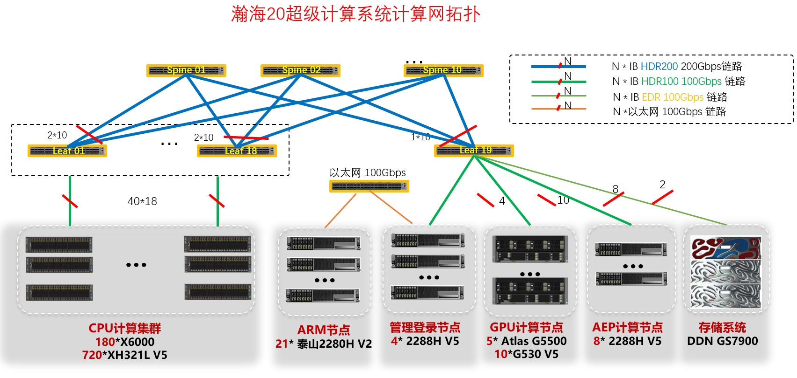

瀚海20超级计算系统
~~~~~~~~~~~~~~~~~~

`瀚海20超级计算系统 <https://scc.ustc.edu.cn/2019/1206/c435a407486/page.htm>`__\ 采用Mellonax HDR 100Gbps高速互联，具有Intel Xeon Scale 6248、华为鲲鹏920 5250等不同类型CPU及NVIDIA Tesla V100 GPU和华为Atlas 300 AI卡等协处理器，共计2个管理节点、2个用户登录节点、720个普通CPU计算节点（采用高效节能的板级液冷技术）、10个双V100 GPU计算节点、8个2TB Intel AEP大内存节点、20个华为鲲鹏CPU计算节点构成（其中10个各含6颗华为Atlas 300 AI加速卡），计算节点共30480颗CPU核心和20块NVIDIA V100 GPU卡，总双精度浮点计算能力：2.51PFlops（千万亿次/秒，CPU：2.37PFlops，GPU：0.14PFlops），Atlas计算能力：3840 TOPS INT8 + 15360T FLOPS FP16。

-  管理节点（2个）：

   用于系统管理，普通用户无权登录。

   ============== =================================  ==========  ========== =========================
   节点名                    CPU                       内存        硬盘              型号
   ============== =================================  ==========  ========== =========================
   admin[01 -02]  2*Intel Xeon Scale 6248            192GB DDR4  2*1TB NVMe 华为FusionServer 2288H V5
                  (2.5GHz，20核，27.5MB)，40核/节点  2933MHz
   ============== =================================  ==========  ========== =========================

-  用户登录节点（3个）：

   -  用于用户登录、编译与通过作业调度系统提交管理作业等。

   -  禁止在此节点上不通过作业调度系统直接运行作业。

   =============== ========================================================= =================== =========== =========================
   节点名                     CPU                                                内存              硬盘              型号
   =============== ========================================================= =================== =========== =========================
   login[01 - 02]  2*Intel Xeon Scale 6248(2.5GHz，20核，27.5MB)，40核/节点  192GB DDR4 2933MHz  2*1TB NVMe  华为FusionServer 2288H V5

   Taishan-Login   16*Hi1620 ARM CPU(2.6GHz)                                 64GB DDR4 2666MHz    50GB       华为泰山 2280H V2
   =============== ========================================================= =================== =========== =========================

-  Intel Xeon CPU普通计算节点（720个）：

   用于多数作业。

   ================ ======================================================== =================== =========== ============================
   节点名                    CPU                                                  内存                硬盘              型号
   ================ ======================================================== =================== =========== ============================
   cnode[001 - 720] 2*Intel Xeon Scale 6248(2.5GHz，20核，27.5MB)，40核/节点 192GB DDR4 2933MHz  1*240GB SSD  `华为FusionServer XH321L V5 <http://e.huawei.com/cn/products/servers/x-series/xh321l-v5>`__
   ================ ======================================================== =================== =========== ============================

-  Intel Xeon CPU 2TB AEP内存计算节点（8个）：

   `AEP内存 <https://www.intel.cn/content/www/cn/zh/architecture-and-technology/intel-optane-technology.html?erpm_id=2040227>`__\ 性能低于普通内存，性价比高，适合大内存应用。

   ============== ======================================================== =================== ============  ======== =========================
   节点名                   CPU                                               普通内存            AEP内存       硬盘              型号
   ============== ======================================================== =================== ============  ======== =========================
   anode[01 - 08] 2*Intel Xeon Scale 6248(2.5GHz，20核，27.5MB)，40核/节点 384GB DDR4 2933MHz  2TB(8*256GB)  1TB NVMe 华为FusionServer 2288H V5
   ============== ======================================================== =================== ============  ======== =========================

-  GPU计算节点（12个）：

   适合GPU应用，加速性能：\ https://developer.nvidia.com/hpc-application-performance\ 。

   =================== ========================= ==================== =========================== ======================  =========================
   节点名                 CPU                             内存               GPU                   硬盘                    型号
   =================== ========================= ==================== =========================== ======================  =========================
   gnode[01 - 10]       2*Intel Xeon Scale 6248   384GB DDR4 2933MHz  2*NVIDIA Tesla V100          1TB NVMe               华为FusionServer G530 V5
                        (2.5GHz，20核，27.5MB)，
                        40核/节点  

   gnode-a100-[1 - 2]   2*AMD Rome 7742           1TB DDR4 3200MHz    8*NVIDIA A100 Tensor Core,  2*1.92TB+4*3.84TB NVME  融科联创RW-4124GO-NART
                        (2.25GHz, 64核)，                             40GB，NVLink
                        128核/节点
   =================== ========================= ==================== =========================== ======================  =========================

   .. table:: 单颗NVIDIA Tesla V100 GPU参数
      :align: center

      +---------+-----------+--------------+---------------+------------------------------------+
      | GPU单元 | 显存      | 主频         |      核数     |  计算能力(TFlops)                  |
      |         |           |              +--------+------+----------+--------+--------+-------+    
      |         |           |              | Tensor | CUDA | 深度学习 | 半精度 | 单精度 | 双精度|
      +=========+===========+==============+========+======+==========+========+========+=======+
      | GV100   | 32GB HBM2 | 基准1230MHz，| 640    | 5120 | 112      | 28     | 14     | 7     |
      |         |           | 加速1370MHz  |        |      |          |        |        |       | 
      +---------+-----------+--------------+--------+------+----------+--------+--------+-------+

   .. table:: 单颗NVIDIA A100 Tensor Core GPU参数
      :align: center

      ============================= ===================================
      FP64 峰值性能	                 9.7TFLOPS

      FP64 Tensor Core 峰值性能	     19.5TFLOPS

      FP32 峰值性能	                 19.5TFLOPS

      FP32 Tensor Core 峰值性能	     312TF*LOPS

      BFLOAT16 Tensor Core 峰值性能	 624TF*LOPS

      FP16 Tensor Core 峰值性能	     624TF*LOPS

      INT8 Tensor Core 峰值性能	     1248TOPS*

      INT4 Tensor Core 峰值性能	     2496TOPS*

      GPU 内存	                     40GB

      GPU 内存带宽	                 1555GB/s

      互联	                         NVIDIA NVLink 600GB/s

      多实例 GPU	                 各种实例大小（最大为 7 MIG @10 GB）
      ============================= ===================================

-  鲲鹏计算节点（20个）：

   -  华为ARM V8 CPU，参见：\ https://developer.nvidia.com/hpc-application-performance\ 。

   -  华为Atlas AI卡，主要提供推理能力，参见：\ https://support.huawei.com/enterprise/zh/ai-computing-platform/atlas-300-pid-23464095

   -  注：使用华为Atlas卡，需特殊申请，加入HwHiAiUser组才可以（运行\ ``id``\ 可以查看自己所在组）。

      +----------------+----------------+-----------+-----------+--------------+-------------------+
      |节点名          |CPU             |     内存  |    硬盘   | 计算网络     | 型号              |
      +================+================+===========+===========+==============+===================+
      |rnode[01 - 09]，|2*鲲鹏920 5250  |256GB DDR4 |1*300GB SAS|100Gbps 以太网|华为TaiShan 2280 V2|
      |rnode[11 - 21]  |（48核, 2.6GHz）|2666MHz    |           |（支持RoCE）  |                   |
      |                |，96核/节点     |           |           |              |                   |
      +----------------+----------------+-----------+-----------+--------------+-------------------+

   其中：rnode[12-21]每台配置6颗Atlas 300 AI卡，rnode[01-11]未配置。

   .. table:: 单颗Atlas 300 AI卡参数

      +-----------------+------------------+----------------------------------+
      | 内存            | AI算力           | 编解码能力                       |
      +=================+==================+==================================+
      | LPDDR4x 32 GB， | 64TOPS INT8，    |-  支持H.264硬件解码，64路1080P   |
      | 3200 Mbps       | 256TFLOPS FP16， |   30FPS（2路 3840*2160 60FPS）   | 
      |                 | 256TFLOPS FP16   |                                  | 
      |                 |                  |-  支持H.265硬件解码，64路1080P   |
      |                 |                  |   30FPS（2路 3840*2160 60FPS）   |
      |                 |                  |                                  |
      |                 |                  |-  支持H.264硬件编码，4路1080P    |
      |                 |                  |   30FPS                          |
      |                 |                  |                                  |
      |                 |                  |-  支持H.265硬件编码，4路1080P    |
      |                 |                  |   30FPS                          |
      |                 |                  |                                  |
      |                 |                  |-  JPEG解码能力4x 1080P           |
      |                 |                  |   256FPS，编码能力4x 1080P 64FPS |
      |                 |                  |                                  |
      |                 |                  |-  PNG解码能力4x 1080P 48FPS      |
      +-----------------+------------------+----------------------------------+

-  存储系统：

   -  1台长虹DDN GS7990 GRID Scaler及2台DDN SS9012磁盘扩展柜，配置280块8TB SATA硬盘

   - 并行文件系统：GRID Scaler

   -  实际可用空间：1.5PB

   -  默认用户磁盘配额：100GB

-  计算网络：Mellonax HDR 100Gbps

-  管理网络：千兆以太网

-  操作系统：CentOS Linux 7.7.1908

-  编译器：Intel、PGI和GNU等C/C++ Fortran编译器

-  数值函数库：Intel MKL

-  并行环境：Intel MPI和Open
   MPI等，支持MPI并行程序；各节点内的CPU共享内存，节点内既支持分布式内存的MPI并行方式，也支持共享内存的OpenMP并行方式；同时支持在节点内部共享内存，节点间分布式内存的混合并行模式。

-  资源管理和作业调度：\ `Slurm <https://slurm.schedmd.com/>`__ 19.05.5

-  常用公用软件安装目录：``/opt``。请自己查看有什么软件，有些软件需要在自己等配置文件中设置后才可以使用。

